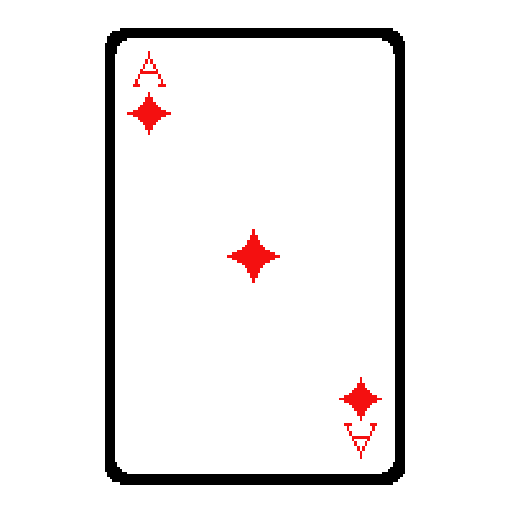

# Casino Game    

A casino style game, in which a player may people a handful of casino games. This was built using Python and Pygame.

### Description

This project uses a pygame based format that allows the user to play games, E.g Blackjack; This is meant to simulate what it would be like to play some casino games but for the comfort of your PC.

### Features

- Single-player style game

### Contributers

- cayloob ( Caleb Raughley )
- amaterasusodd-cmyk (  Chicoryschirping )
- megankimball-creator
- Yuusupport ( Yubii )
